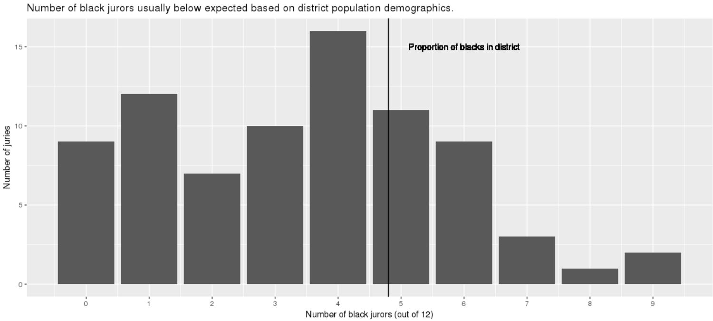

**Take-Home Exam Guidelines.**  

By signing the Pledge below, you certify that you conformed to the following guidelines for this take-home exam:

- You may use all materials from this class (textbook, class notes, Moodle posts, Rmd files, answer keys, etc.).  In addition, google searches are okay; if your search takes you to outside sources that you use, please list the websites' URLs here:
- 
- Obviously, no consulting with anyone else, either in our class or not, and either in-person or electronically (e.g. no posting questions online).  Avoid even comments like “#1 is hard”.
- Questions to Prof Roback are allowed – I may not be able to answer everything, but I’ll answer what I can.
- If you have any questions about what is appropriate, please ask!

Exams are due **before class** on Tuesday, Nov 13th.  (NO exceptions unless cleared with me before exams passed out.)  You should submit a knitted pdf file on Moodle, but be sure to show all of your R code, in addition to your output, plots, and written responses.

**PLEDGE:**  By typing my full name below, I pledge on my honor that I have neither received nor given assistance during this exam nor have I witnessed others receiving assistance, and I have followed the guidelines as described above.  

**SIGNATURE:** (type full name)

&nbsp;
&nbsp;

```{r, setup, include=FALSE}
library(tidyverse)
library(stringr)
library(knitr)
trials <- read_csv("trials.csv")
jurors <- read_csv("jurors.csv")
voirdire <- read_csv("voir_dire_answers.csv")
```

We will focus on data from APM Reports podcast series "In the Dark" about a controversial Mississippi death penalty case and potential racial discrimination in jury selection.  This [link](https://features.apmreports.org/in-the-dark/mississippi-district-attorney-striking-blacks-from-juries/) provides background about the case in question and the analysis of jury selection data over 25 years in Mississippi's Fifth Court District.  This [link](https://github.com/APM-Reports/jury-data) provides descriptions of the 3 data sets and their variables that we will be examining in this exam.  The 3 data sets (jurors.csv, trials.csv, and voir_dire_answers.csv) have been downloaded to the Class > Data folder on the R server.


1. There are two trials in voir_dire_answers.csv that contain data on only a single juror: trials 78 and 270.  We wish to examine these jurors more closely.  First, create the following tibble containing data from the two jurors in trials 78 and 270.  Note that I renamed `juror_id__trial__id` as `trial_id`, `fam_law_enforcement` as `fam_law_enf`, and `death_hesitation` as `death_hes`.

```{r, eval = FALSE}
# A tibble: 2 x 7
  juror_id trial_id accused fam_accused know_def fam_law_enf death_hes
     <int>    <int> <lgl>   <lgl>       <lgl>    <lgl>       <lgl>    
1     3842       78 FALSE   FALSE       FALSE    FALSE       FALSE    
2    13121      270 FALSE   FALSE       FALSE    FALSE       FALSE    
```

Next, create a longer version of that same data:

```{r, eval = FALSE}
# A tibble: 10 x 4
   juror_id trial_id question    answer
      <int>    <int> <chr>       <lgl> 
 1     3842       78 accused     FALSE 
 2    13121      270 accused     FALSE 
 3     3842       78 fam_accused FALSE 
 4    13121      270 fam_accused FALSE 
 5     3842       78 know_def    FALSE 
 6    13121      270 know_def    FALSE 
 7     3842       78 fam_law_enf FALSE 
 8    13121      270 fam_law_enf FALSE 
 9     3842       78 death_hes   FALSE 
10    13121      270 death_hes   FALSE 
```

and then return the longer data set back into its original form:

```{r, eval = FALSE}
# A tibble: 2 x 7
  juror_id trial_id accused fam_accused know_def fam_law_enf death_hes
     <int>    <int> <lgl>   <lgl>       <lgl>    <lgl>       <lgl>    
1     3842       78 FALSE   FALSE       FALSE    FALSE       FALSE    
2    13121      270 FALSE   FALSE       FALSE    FALSE       FALSE    
```

Finally, form the following tibble for the two jurors from trials 78 and 270.  Note the following features:

- `numTrue` is the total number of TRUE responses to the 5 questions in the previous tibble
- the variables `year`, `casenum`, and `defendant` all come from the `trial` variable in jurors.csv
- you can strip off anything in square brackets in the case number portion of `trial`.  `str_sub` can be helpful here.
- `year` is double precision

```{r, eval = FALSE}
# A tibble: 2 x 6
  juror_id trial_id  year casenum defendant    numTrue
     <int>    <int> <dbl> <chr>   <chr>          <int>
1     3842       78  1995 7009    Ricky Lenard       0
2    13121      270  1992 4419    Jerry Holmes       0
```


2. voir_dire_answers.csv contains data from 89 trials (after filtering out one row corresponding to a trial id of NA).  We wish to find summary statistics and create plots to compare strike rates by the State prosecutor for black and white potential jurors.

a) When tidying your data, be sure to:

- exclude jurors with unknown race
- only include jurors who are eligible to be struck by the State (i.e. `strike_eligibility` is either "Both State and Defense" or "State")
- create a new variable which specifies if a juror's `race` is the same as the `defendant_race`
- create a new variable which specifies if a juror was "Struck by the state" or not (as recorded in `struck_by`)

b) Produce the following summary table:

```{r, eval = FALSE}
# A tibble: 2 x 4
  race  prop_struck num_struck total
  <chr>       <dbl>      <int> <int>
1 Black       0.534        396   741
2 White       0.114        175  1541
```

c) Produce a segmented (filled) bar chart illustrating the `prop_struck` comparison in the table above.

d) Produce a faceted (side-by-side) bar chart illustrating black vs. white strike rates for potential jurors who are the same race as the defendant and those who are a different race than the defendant.

e) Produce a faceted (side-by-side) bar chart illustrating black vs. white strike rates for potential jurors who have been accused of crimes in the past and those who have not.

f) Comment on how your plots in (d) and (e) help illustrate how the black vs. white difference in strike rates persists even after controlling for other factors that may affect strike decisions.


3. Create a plot with year on the x-axis and the ratio of proportion of black jurors struck by the state to the proportion of white jurors struck by the state on the y-axis (e.g. if 60% of black jurors are struck in a given year and 20% of white jurors, the ratio would be 3).  When answering this question, be sure to:

- use `spread` if at all possible
- filter out years with ratios above 10, since they tend to overwhelm the plot
- include a red horizontal line where the ratio is 1, which would indicate that black and white jurors are struck at the same rate
- comment on conclusions you can draw from your plot


4. 

a) Set `x <- (trials %>% filter(voir_dire_present) %>% distinct(def_attny_1))[[1]]`.  This should produce a list of 95 defense attorneys from trials where a jury selection transcript existed.  Then use `str_subset` to find attorneys whose names meet the following criteria (do 5 independent searches):

- has same name as one's father (e.g. Jr, II, III, IV, etc.)
- has a middle initial instead of a middle name
- has two repeated letters in their name (e.g. "tt" or "ee" but not "II" or "III"; if a name has both "tt" and "II" that counts)
- has a last name that ends with r or s
- has a first name that starts with 1 vowel but not 2 vowels

b) Create a table of the approximate number of potential jurors in each county who were struck because they were related to the defendant or another potential juror.  To do this, search for the terms "relat", "cousin", or "kin" in the `notes` column of voir_dire_answers.csv.


5. Recreate the plot below.  Only consider trials where there are exactly 12 jurors in our database who were selected to serve (i.e. where `struck_by` is "Juror chosen to serve on jury").  Also note that the vertical line is based on 40% black population in the district.

```{r, echo = FALSE}

```
